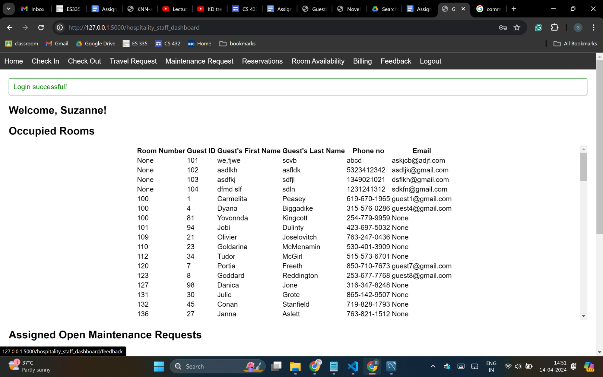
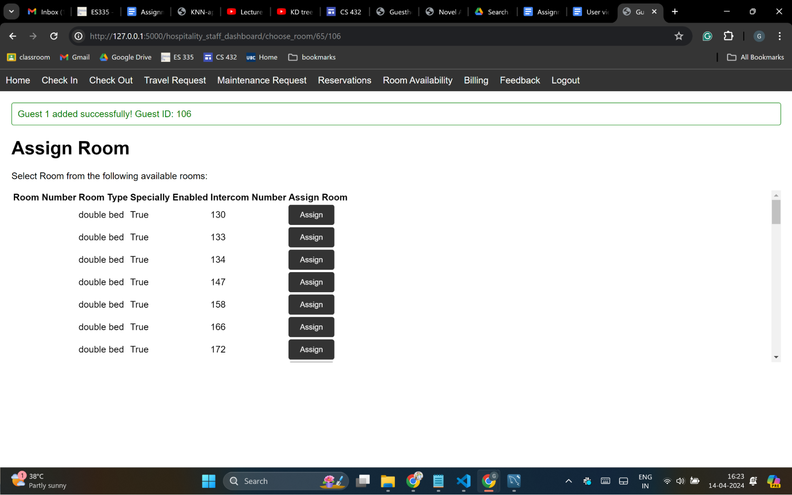

IITGN Guest House Management System (GHMS)

* * *

Assignment 4: Deploying the DBMS

Team: First Order

Gaurav Shah - 21110064

Soham Rahatal - 21110173

Pratik Agarwal - 21110166

Rohit Srivastav - 21110180

Banavath Diraj Naik - 22110044

Sohitha Sonalika - 22110151

Shivamani - 22110062

3.1 Responsibility of G1:

1.1 Initial Feedback

From the initial feedback by M. Yashwant Chouhan from the Guesthouse, we have added the following functionalities to our WebApp:  

1.  Added changes to the Travel Request Management part of the admin dashboard. In the first version of the web app, when a travel request is raised by the hospitality staff or the current guest, it gets displayed as an unassigned request on the ‘Travel Request’ page of the hospitality_staff dashboard until the driver is not assigned. Then, one of the admin users assigns the request to one of the drivers by looking at his/her records and the pending requests. This version showed the drivers on the available list even when another pending request was assigned at the exact pick-up time and date. We have fixed this by updating the SQL query, initially fetching the list of available drivers by fetching the drivers that don’t have a pending request  to the given request.

    driver_available = \[\]  
   fordrivers indriver_all:  
       pending\_requests = travel\_request.query.filter(travel\_request.driver\_license == drivers.driver\_license, travel\_request.date\_of\_travel >= request.date\_of\_travel).all()  
       l = len(pending_requests)  
       i = 0  
       forpending_request in pending_requests:  
           ifpending\_request.date\_of\_travel == request.date\_of_travel andabs(request.pick\_up\_time.hour - request.pick\_up\_time.hour) < 6:  
               print(pending_request)  
               breaki += 1  
       if i == l:  
           driver_available.append(drivers)  
   print(driver_available)

Before:

Both travel requests get assigned to driver 9.

After:

As the first request is assigned to driver 10, and the second request’s pick-up time is within one hour of the first request, driver 10 is not on the list of available drivers on the driver assignment page. Therefore, driver two is selected.

2.  We have also added a new webpage called ‘Room Availability’ in the hospitality_staff dashboard, enabling the staff to check the room availability of the rooms in the guesthouse. This will help the staff not to underbook or overbook reservations. Staff can enter a date on which he/she wants to see the room availability and then will be redirected to a new page where they can see the number of rooms available by type. They can’t see exactly which room (by its number) is available as the room assignment is done at check-in and not while reserving.

Implemented by creating new routes in admin.py, writing the necessary SQL queries, and creating the necessary HTML pages.

Before:

There is no page called “Room Availability” in the initial version.

After:

Room availability by date can now seen as above. Therefore, the staff can check whether the requested rooms are available when making a new reservation.

3.  There wasn’t a feedback form page in the current\_guest dashboard for adding feedback. This has been corrected to allow current guests to write about their stay and the submitted feedback can be seen in the hospitality\_staff dashboard.

Before:

Current Guest Dashboard

Hospitality Staff Dashboard

The current guests can’t give their feedback, so the entries in the “Feedback” page in the hospitality staff’s dashboard are NULL.

After:

Current Guest Dashboard

Hospitality Staff Dashboard

Guests can give feedback from their dashboards, and the hospitality staff can see them from their dashboards.

1.2 Final Feedback

As per the final feedback by Mr. Yashwant Chouhan, we have added the following new features to our database:

1.  Reservation Confirmation for requests made by IITGN members

Initially, when the IITGN Members filled out the reservation form from their dashboards, a new reservation was directly created without the approval from the hospitality staff team. To tackle this issue, we have created a new column in the reservation table in the database called ‘confirmed’ using the query:        

     altertablereservation addcolumn confirmed bool;

which will help us track the confirmation status of the reservations.

Now, when an IITGN Member creates a reservation, a new reservation does

get added to the reservation table, but confirmed = FALSE until the hospitality staff approves the reservation. Also, if a reservation is not confirmed and the check-in date exceeds today, it automatically gets deleted from the reservation table.

The reservation made by hospitality staff automatically has confirmed = TRUE

Before:

Reservation form in IITGN Member Dashboard

Reservation directly gets made without confirmation

Reservation page in Hospitality Staff’s dashboard

  

After:

Reservation form in IITGN Member Dashboard

On submission, this creates a reservation request

Home page in IITGN Member Dashboard

Reservation page in Hospitality Staff Dashboard

After clicking on confirm button

Home page in IITGN Member Dashboard after reservation confirmation

2.  Room cleaning maintenance request during check-out

When a guest checks out, his/her room must be cleaned before it can be assigned to another guest during check-in. Therefore, we have implemented this as follows:

1.  When a current guest checks out, a new maintenance request is created: "CHECK-OUT: Cleaning in room {room_no}.”
2.  A new entry is added to an existing table, ‘requires\_maintenance,’ with request\_id and room_no.
3.  This maintenance request is assigned to a housekeeping staff following the same procedure as before, but now we have added a new page to the housekeeping staff dashboard called “Room Cleaning.”  This will help to keep track of check-out cleaning and other maintenance requests easily.
4.  Until the room cleaning request is closed by the housekeeping staff to whom it was assigned, the room is not shown in the list of available rooms during the check-in.

Before:  

The room checked-out on the same day visible as available room for check-in

After:

Room cleaning maintenance request created automatically

Room 112, which was checked out, is not visible in the check-in room assignment, as the maintenance request hasn’t been closed .

Housekeeping Staff Dashboard

2\. User Views and Privileges in the database

1.  Hospitality Staff Dashboard (Admin) :

* This hospitality staff dashboard is the home page and we can see the options shown above are:

* Check-in: This navigates to the page that shows that day’s reservations.
* Check-out: This navigates to the page that shows that day’s check-outs and check-out billings.
* Travel request: This navigates to the page that shows completed and unassigned travel requests.
* Maintenance request: This navigates to the page that shows open and closed maintenance requests.
* Reservations: This navigates to the page that shows all the reservations.
* Billing: This navigates to the page where we can create or generate a Bill.
* Feedback: This navigates to the page that shows all the feedbacks.
* Logout: This can be used to logout from the current account.

2.  Current Guest Dashboard:

* This current guest dashboard is the home page of the current guest. We can see the options shown above are:

* Travel request: This navigates to the page where the guest can make a travel request.
* Maintenance request: This navigates to the page where the guest can make a maintenance request.
* Show bills: This navigates to the page that shows all the bills
* Change password: This navigates to the page where the user can change password.
* Logout:  This can be used to logout from the current account.

3.  IITGN Member Dashboard:

* This is the  IITGN member dashboard and we can make a reservation through the above shown option.
* This current guest dashboard is the home page and the user can login with their credentials through the login button shown above.

4.  Housekeeping Staff Dashboard:

* This is the  housekeeping staff dashboard and we can see the assigned requests for housekeeping staff through the above shown option.
* And from the logout option we can logout from the dashboard.

5.  Driver Dashboard:

* This is the  driver dashboard and we can see the assigned requests for driver through the above shown option.
* And we can logout through the logout option beside the assigned requests option.

3.2 Responsibility of G2:

1\. Concurrent multi-user access

As you may know, our web app has different logins, so different types of users can access our web app and can modify the database concurrently. For this, we applied locks for some of our database tables so that at a time, only a user can update the information, preventing concurrent transactions from interfering with each other.

For example, guest\_travel\_request form can be filled by multiple users/guests. So, we applied locks using SQLAlchemy’s (python SQL toolkit, which is used to manage SQL databases using pythonic language) support.

Code for guest\_travel\_request page with locking mechanism

For acquiring locks :

locked\_table = select(travel\_request).with\_for\_update()

The above line creates an SQL statement “select _ _ _ for update”\[6\] that selects rows from the database table ‘travel_request’ and acquires a lock on them to prevent any other transaction from being modified until an existing transaction finishes.

db.session.commit(): This line commits the changes made within the transaction to the database and releases the lock acquired earlier.

To implement concurrent multi-user access, locks have been applied to the tables like travel\_request, guest\_travel\_request, maintenance\_request, guest\_maintenance\_request, reservation & bill.

2\. Google Authentication

Our web app has five different logins, and hospitality\_staff (administrator) and iitgn\_member are the only ones with an iitgn email ID. So, we added google authentication for hospitality\_staff members and iitgn\_member.

When you click on the \[Google Connect\] button to authenticate →

We are redirected to the page below to select the Google account.

After selecting the iitgn account i.e., [sohamrahatal@iitgn.ac.in](mailto:sohamrahatal@iitgn.ac.in)

We are redirected to the iitgn\_member dashboard as my email\_id/profile is present in the iitgn\_member database table of our database ‘guesthouse\_db’.

If an email\_id is related to hospitality\_staff, then that account will be redirected to the hospitality_staff dashboard of the web app.

For the rest logins, like driver, guest, and housekeeping\_staff, they will have to login through the normal login system of the web app as they don’t have iitgn email\_id.

3.3 Responsibility of G1 & G2:

1\. Attacks on our WebApp

1.  SQL Injection Error Attack:

We try the first method, where we try to add an OR condition that is always true i.e. 1=1, to modify the SQL query generated through the form.

We received an ‘Invalid Credentials’ message, and we could not hack into the system.

We tried the second method, where we used the symbol “--” which is used to comment in MySQL. It would comment the SQL code after it, such that we would be able to hack into the system.

We received an ‘Invalid Credentials’ message, and we could not hack into the system.

Our System was able to withstand SQL Injection attacks because it uses parameterized queries, specifically through the ORM (Object-Relational Mapping) methods provided by the SQLAlchemy library to interact with the database.

2.  XSS Attack:

We tried to attempt an XSS attack at the login page in our website, if the attack is successful we would recieve an alert pop-up of “XSS_Attack!” on web-page.

We received an ‘Invalid Credentials’ message, and we could not conduct a XSS attack on the login page.

Next we tried to test for XSS attack in admin login where in Maintenance request form, I entered my own script. Upon sucessfull attack, we would recieve an alert pop-up of “XSS_Attack!” on the web-page.

Our attempt to insert script is failed and the maintenance request form is submitted with our entered code as plain description text of the form. We could not conduct a sucessful XSS attack on the admin page.

We could not conduct XSS attacks sucessfully on our system, because Flask and its template engine Jinja2 have built-in protections against XSS. Flask-WTF provides built-in protection against XSS attacks by automatically escaping HTML entities when rendering form fields and Jinja2 automatically escapes HTML entities by default when rendering templates. Moreover, Modern web browsers like Google Chrome also have built-in XSS protection mechanisms that might prevent certain XSS attacks from being executed.

3.  Cross-Site Request Forgery (CSRF) Attack:

An external site might access the crsf_token for sensitive user information in the website, like changing passwords in the current guest account.

We tried to test if an external site can request to modify the user data without their information on their behalf.

curl -X POST -H "X-CSRFToken: ImFhNDMxOTViZTU0YTIyNDY3MzIwNTQ1ZDEwMGQ3OTEzMzNlMzExM2Ei.Zhl6zA.j6K\_bhpALVkQ42yENQtwS0QHa4I" -d "old\_password=abcdef" -d "new\_password=pass123" -d "confirm\_password=pass123" http://127.0.0.1:5000/current\_guest\_dashboard/change_password

We executed the above code to try to change the current password of the guest (“abcdef”) to a new password (“pass123”).

We are unauthorized in changing the password for the user externally, and their data is protected.

Flask extensions such as Flask-WTF render a CSRF token that is automatically generated and included in the form. This token is unique per session and form. Therefore, Flask-WTF automatically adds CSRF protection to all forms created with it.

4.  Path Traversal Attack

We are looking that if a housekeeping staff is able to hack into to the system and access sensitive information of current guests and members through locally stored files.

Code to test for path traversal attack

1.  To test for file traversal attack, we imported the requests library, which is a popular Python library that makes HTTP requests.
2.  Setting the target URL: The URL of the web page you're testing is defined. In this case, it's set to '[http://127.0.0.1:5000/hospitality\_staff\_dashboard](https://www.google.com/url?q=http://127.0.0.1:5000/hospitality_staff_dashboard&sa=D&source=editors&ust=1713109262033350&usg=AOvVaw1HwLdBa2o0uyfFAfGKpF7j)'.
3.  Defining the payloads (../): A list of payloads to test is defined. These payloads are common path traversal sequences that attempt to move up in the directory structure.
4.  Getting user input: The script asks for user input. This input is expected to be the remaining part of the path after the payload
5.  Sending the requests and checking the responses: The script then enters a loop where it iterates over each payload. For each payload, it:

1.  Sends a GET request to the URL with the payload and user input as a parameter.
2.  Prints the response.
3.  Checks if the response includes sensitive information. If it does, it prints a message indicating that the application is vulnerable to path traversal. If it doesn't, it prints a message indicating that the application is not vulnerable to path traversal.

1.  \`etc/passwd\`

This is a Unix file that contains user account information. It should not be accessible through a web application.

We tried to insert user input to test on the terminal

We received an unauthorized error response, and we could not access sensitive information

2.  \`etc/shadow\`

We tried to insert user input to test on the terminal

We received an unauthorized error response, and we could not access sensitive information

 This is another Unix file that contains encrypted password information. It should also not be accessible.

3.  \`var/www/html/index.html\`

This is a common location for the main HTML file of a web server. If you can access this file, it might indicate a path traversal vulnerability.

We tried to insert user input to test on the terminal

We received an unauthorized error response, and we could not access sensitive information

4.  4\. \`home/&lt;username&gt;/.ssh/id_rsa\`

This is the location of the private key for SSH on a Unix system. If you can access this file, it's a serious security vulnerability.

We tried to insert user input to test on the terminal

We received an unauthorized error response, and we could not access sensitive information

5.  \`Windows/System32/drivers/etc/hosts\`

This is the location of the hosts file on a Windows system. If you can access this file, it might indicate a path traversal vulnerability.

We tried to insert user input to test on the terminal

We received an unauthorized error response, and we could not access sensitive information

The Flask web framework, has several built-in features that help protect against path traversal attacks:

URL Routing: Flask uses URL routing to map URLs to Python functions (known as routes). When a request is made to a URL, Flask executes the corresponding function and returns the result as a response. This means that the URLs in your application don't directly map to files or directories on your server, which makes path traversal attacks difficult.

Template Rendering: Flask uses the Jinja2 template engine to render views. When you call render_template, Flask looks for the specified template file in your templates folder, renders it, and returns the result as a response. This process is safe from path traversal attacks because Flask doesn't expose your file system structure to the client.

Form Handling: The request object in Flask provides a secure way to handle form data. When you call “request.form.get”, Flask retrieves the specified form field from the request. This process is safe from path traversal attacks because Flask doesn't use the form data to access files or directories on your server.

Database Access: Flask-SQLAlchemy, which you're using to interact with your database, uses SQLAlchemy's ORM (Object-Relational Mapping) to map Python classes to database tables. This means that your database queries don't directly map to files or directories on your server, which makes path traversal attacks difficult.

Configuration: Flask's configuration system allows you to store sensitive information, like your secret key and database URI, in your application's configuration. This information is not exposed to the client, which helps protect against path traversal attacks.

 2\. Relations and their Constraints from feedback relation with ER Diagram in Assignment 1

ER Diagram as In Assignment 1

Relationships post Second Feedback

1.  Occupancy: current_guest and room

2.  affiliation: current_guest and iitgn_member

3.  booking:current_guest and reservation

4.  assignment:room and reservation

5.  requires_maintainence:room and maintainence_request

6.  manages_maintainence:hospitality_staff and maintaince_request

7.  manages_reservation:hospitality_staff and reservation

8.  assigned_to:maintaince_request and housekeeping_staff

9.  incurres_bill:guest and bill

10. generates_bill:hospitality_staff and bill

11. travel\_Request: current\_guest and travel_request

12. assigned_driver: travel_request and drivers

13. manage\_travel\_request: hospitality\_staff and travel\_Request

14. feedback\_history: current\_guest and feedback

Validation with ER Diagram

1.  Occupancy: current_guest and room

Constraint: The guest is always assigned a room, which may or may not be assigned to a particular guest.

Validity: This constraint is present and valid as it allows for the relationship between the current guest and the room.

2.  Affiliation: current\_guest and iitgn\_member

Constraint: A current guest must be affiliated with the IITGN member.

Validity: This relationship is present and valid, adhering to the constraint.

3.  Booking: current_guest and reservation

Constraint: A current guest must have a reservation under their name.

Validity: This relationship is present and valid as it allows for multiple reservations per guest.

4.  Assignment: room and reservation

Constraint: A new room shall be assigned for every single reservation.

Validity: This relationship is present and valid, allowing for multiple reservations to be associated with a room.

5.  Requires\_maintenance: room and maintenance\_request

Constraint: A room can require maintenance, and there can be multiple maintenance requests for different rooms.

Validity: This relationship is present and valid, adhering to the constraint.

6.  Manages\_maintenance: hospitality\_staff and maintenance_request

Constraint: Hospitality staff can manage multiple maintenance requests.

Validity: This relationship is present and valid, allowing staff to manage multiple maintenance requests.

7.  Manages\_reservation: hospitality\_staff and reservation

Constraint: Hospitality staff can manage multiple reservations.

Validity: This relationship is present and valid, adhering to the constraint.

8.  Assigned\_to: maintenance\_request and housekeeping_staff

Constraint: Maintenance requests can be assigned to multiple housekeeping staff members.

Validity: This relationship is present and valid, allowing for multiple staff members to be assigned to maintenance requests.

9.  Incurs_bill: guest and bill

Constraint: A guest can incur multiple bills.

Validity: This relationship is present and valid, allowing for multiple bills to be associated with a guest.

10. Generates\_bill: hospitality\_staff and bill

Constraint: Hospitality staff can generate multiple bills.

Validity: This relationship is present and valid, adhering to the constraint.

11. Travel\_Request: current\_guest and travel_request

Constraint: A current guest can have multiple travel requests.

Validity: This relationship is present and valid, allowing for multiple travel requests per guest.

12. Assigned\_driver: travel\_request and drivers

Constraint: A travel request must be assigned to a single driver.

Validity: This relationship is present and valid, allowing for drivers to be assigned to a travel request.

13. Manage\_travel\_request: hospitality\_staff and travel\_request

Constraint: Hospitality staff can manage multiple travel requests.

Validity: This relationship is present and valid, adhering to the constraint.

Feedback\_history: current\_guest and feedback

Constraint: A current guest can have multiple feedback entries.

Validity: This relationship is present and valid, allowing for multiple feedback entries per guest.

4\. Contributions:

1.  Gaurav Shah (Group Leader)

* Completed all the changes in the WebApp as mentioned in both feedbacks.
* Created the final report.

2.  Soham Rahatal

* Added locks for some database tables for concurrent multi-user access
* Added the Google authentication for the admin and iitgn_member
* Collected feedback from stakeholders with Gaurav & Pratik
* Involved in the drafting of the final report.

3.  Pratik Agrawal

* Conducted tests for SQL Injection, XSS, CRSF, & Path Traversal attacks
* Completed Validity of Relationships after feedback with ER diagram
* Collected feedback from stakeholders with Gaurav & Soham
* Involved in the drafting of the final report.

4.  Rohit Srivastava

* NO CONTRIBUTION

5.  Banavath Diraj Naik

* Q2 in Responsibility for G1

6.  Sohitha Sonalika

* Q2 in Responsibility for G1

7.  Shivamani

* Q2 in Responsibility for G1

Sub-groups:

G1:  Pratik Agarwal, Rohit Srivastav, Banavath Diraj Naik,Sohitha Sonalika

G2: Gaurav Shah, Soham Rahatal, Shivamani

References:

1.  [https://guesthouse.iitgn.ac.in/booking.php](https://www.google.com/url?q=https://guesthouse.iitgn.ac.in/booking.php&sa=D&source=editors&ust=1713109262050917&usg=AOvVaw3WE7K61gbXe43zCTPT0Clc)
2.  [https://guesthouse.iitgn.ac.in/accommodation_facility.html](https://www.google.com/url?q=https://guesthouse.iitgn.ac.in/accommodation_facility.html&sa=D&source=editors&ust=1713109262051325&usg=AOvVaw0JSPpzoA3ZWEVm8fi1kcuh)

* * *

The End

