**Steps to Run Webpage**

1. Activate Virtual Environment

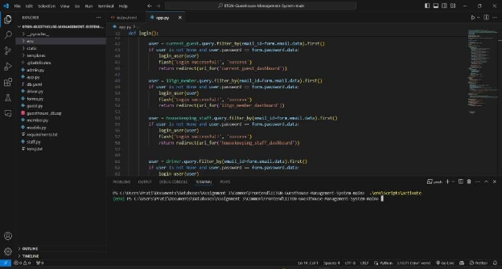

2. Install Requirements for app.py

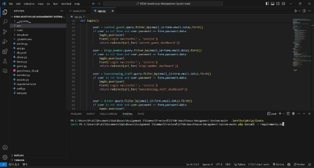

3. Run app.py, and move to link <http://127.0.0.1:5000/> on the web-page

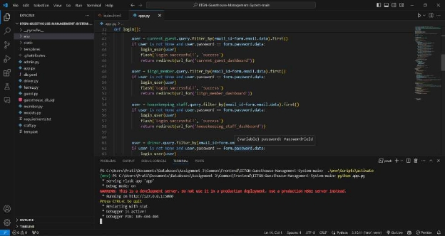

4. The Home Page of the Website is loaded

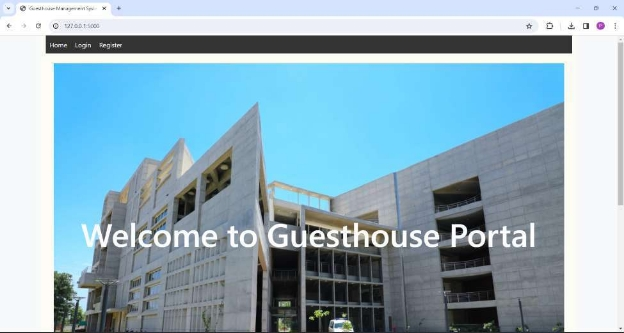

5. Move to Login window to access the portal

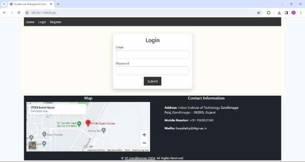

After Login, based on your login credentials you will be redirected to:

1. Hospitality Staff Portal (Admin/Stakeholder)

   (example - email: <admin1@iitgn.ac.in> & password: 123456)

2. IITGN Members Portal (User)

   (example - email: <member1@iitgn.ac.in> & password: 123456)

3. Current Guest Portal (User)

   (example - email: guest1@gmail.com & password: sC2k5&HS=9"H. )

Hospitality Staff

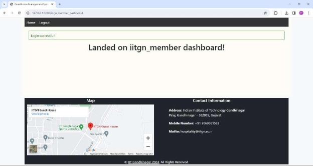

IITGN Member Dashboard

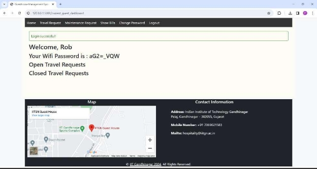

Current Guest Dashboard

**Screenshots of Successful execution of dynamic operations**

1. **INSERT**
1. Before Inserting Data

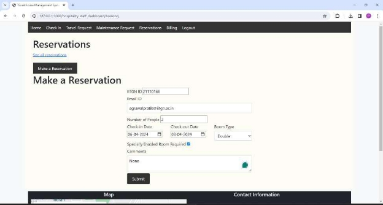

Data to be Inserted

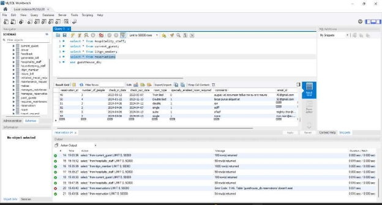

Reservation ID only upto 54 entries

2. After Inserting Data

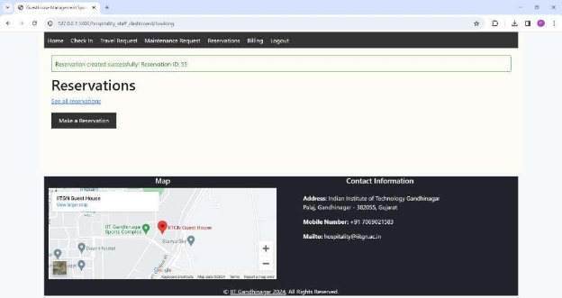

Reservation Successful Message with Reservation ID

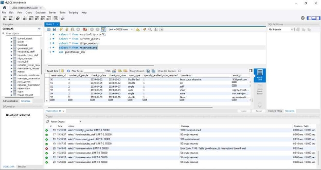

Reservation of ID 55 is added to MySQL database

2. **UPDATE**
1. Before Update

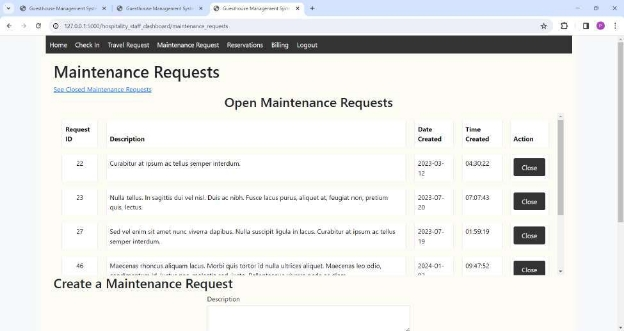

We will be updating Maintenance Request ID=23 to closed

2. After Update

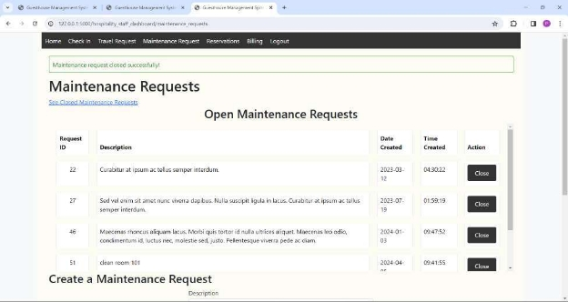

Pop-up Indicating Maintenance Request Closed

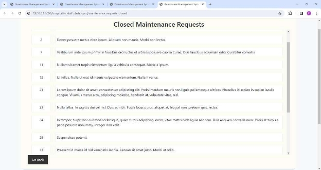

We can See Request ID=23 in Closed Maintenance Requests Section

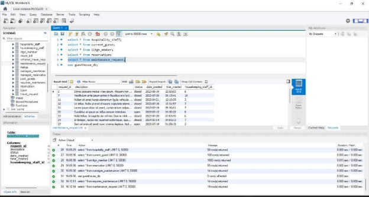

In SQL Database we can see status for Request ID=23 is updated to ‘closed’

4. **RENAME**
1. Before Renaming Password of Guest ID=4

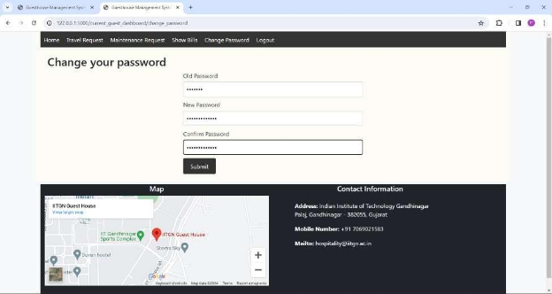

Window to Change Password

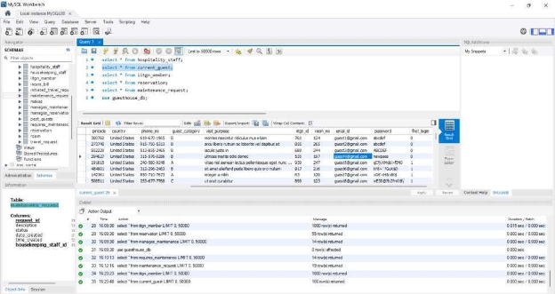

The initial Password of Guest 4 is ‘newpass’

2. After Renaming Password for Guest ID=4

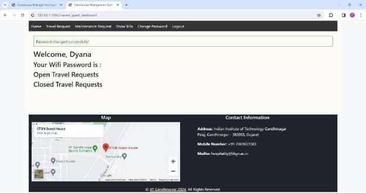

Pop Up indicating password change is sucessful

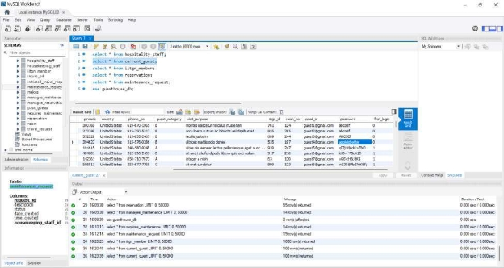

In Database, the password is renamed to ‘appleisbetter’

5. **Where Clause**
1. Before applying where clause

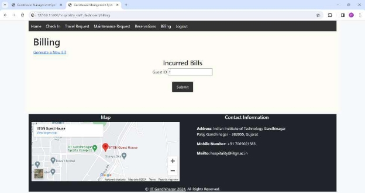

Generating Incurred Bills where Guest ID=1

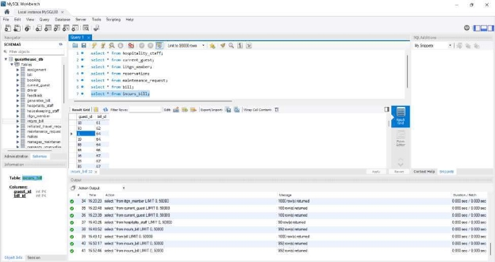

We Can See the Incurs\_bill table that establishes relationship between guest\_id and bill\_id

2. After applying where clause

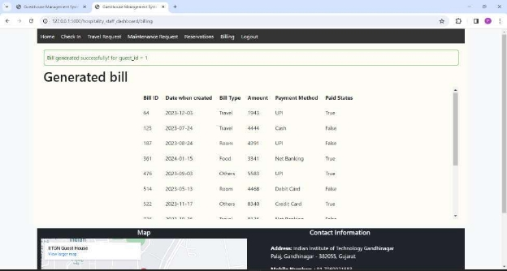

We Received a successfully generated popup, and all bills that are incurred by Guest ID=1

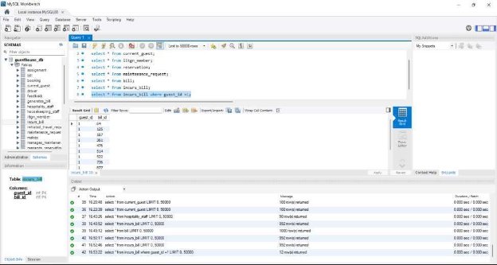

We have segregated the bills that are incurred by Guest ID=1 in MySQL Database using the ‘where’ statement.

3\. Contributions:

1. Gaurav Shah (Group Leader)
- Created the design of the webapp for different views
- Created dashboards for different views
- Wrote code for the Backend part of the webapp
2. Soham Rahatal
- Helped in the Backend part of the webapp; creating some pages for admin (hospitality\_staff dashboard)
- Helped in the documentation part of the report
3. Pratik Agrawal
- Completed the entire website Frontend, using the Bootstrap framework.
- Designed Initial Sketches for the website and user interface.
- Drafted Readme Report with explanations.
4. Rohit Srivastava
- Attended Initial Meeting on website ideation
4. Banavath Diraj Naik
- Attended Initial Meeting on website ideation
4. Sohitha Sonalika.
- Attended Initial Meeting on website ideation
- Created Initial Contacts page
7. Shivamani
- Attended Initial Meeting on website ideation
- Created feedback page for admin (hospitality\_staff dashboard) view

Sub-groups:

G1: Pratik Agarwal, Rohit Srivastav, Banavath Diraj Naik, Sohitha Sonalika G2: Gaurav Shah, Soham Rahatal, Shivamani

The End

