Steps to Run Webpage

1.  Activate Virtual Environment

2.  Install Requirements for app.py

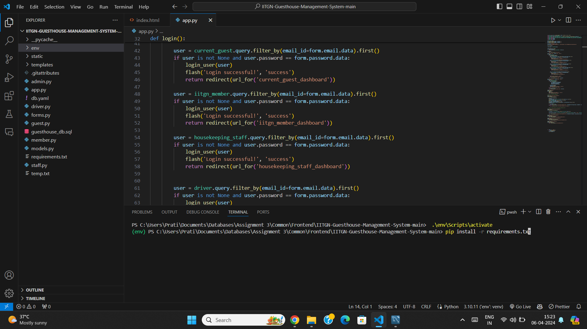

3.  Run app.py, and move to link [http://127.0.0.1:5000/](https://www.google.com/url?q=http://127.0.0.1:5000/&sa=D&source=editors&ust=1712433356283156&usg=AOvVaw2JeiUpgIv63dXY8DcXLpiW) on the web-page

4.  The Home Page of the Website is loaded

5.  Move to Login window to access the portal

After Login, based on your login credentials you will be redirected to:

1.  Hospitality Staff Portal (Admin/Stakeholder)

(example - email: [admin1@iitgn.ac.in](mailto:admin1@iitgn.ac.in) & password: 123456)

2.  IITGN Members Portal (User)

(example - email: [member1@iitgn.ac.in](mailto:member1@iitgn.ac.in) & password: 123456)

3.  Current Guest Portal (User)

(example - email: guest1@gmail.com & password: sC2k5&HS=9"H. )

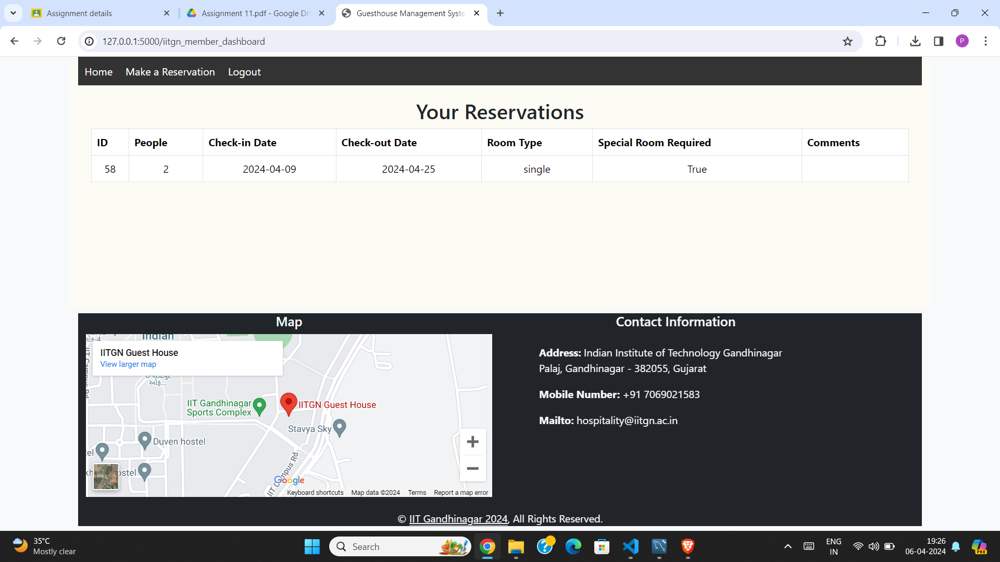

                                        Hospitality Staff

                                        IITGN Member Dashboard

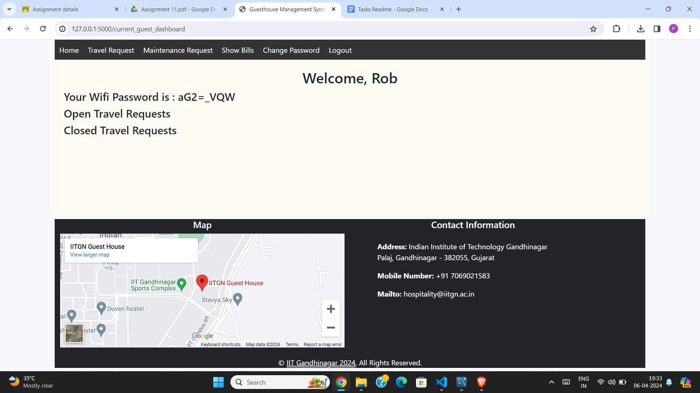

                                        Current Guest Dashboard

Screenshots of Successful execution of dynamic operations

1.  INSERT

1.  Before Inserting Data

Data to be Inserted

Reservation ID only upto 54 entries

2.  After Inserting Data

Reservation Successful Message with Reservation ID

Reservation of ID 55 is added to MySQL database

B. DELETE

1.  Before Deleted

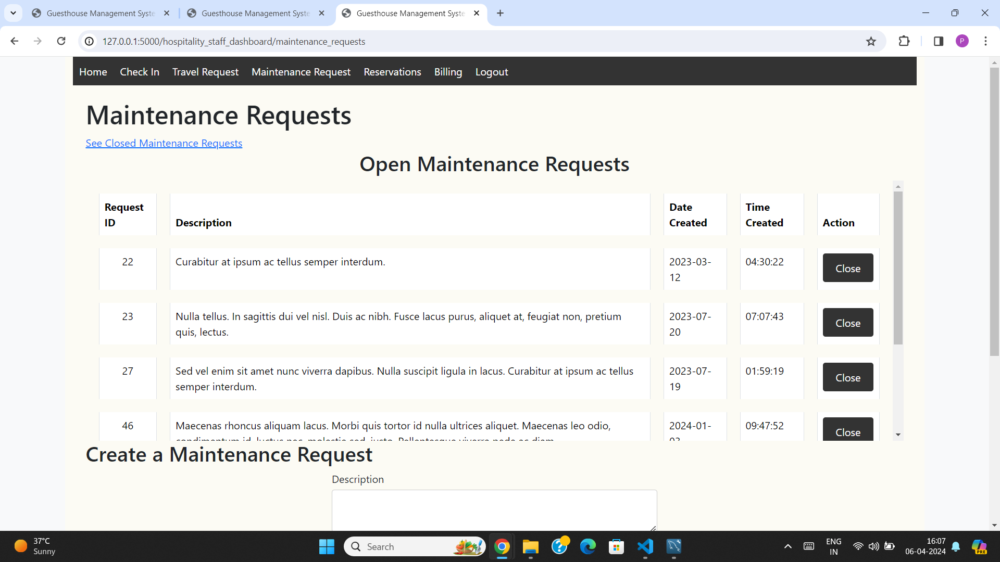

We will be deleting Maintenance Request ID=23 to closed

2.  After Update

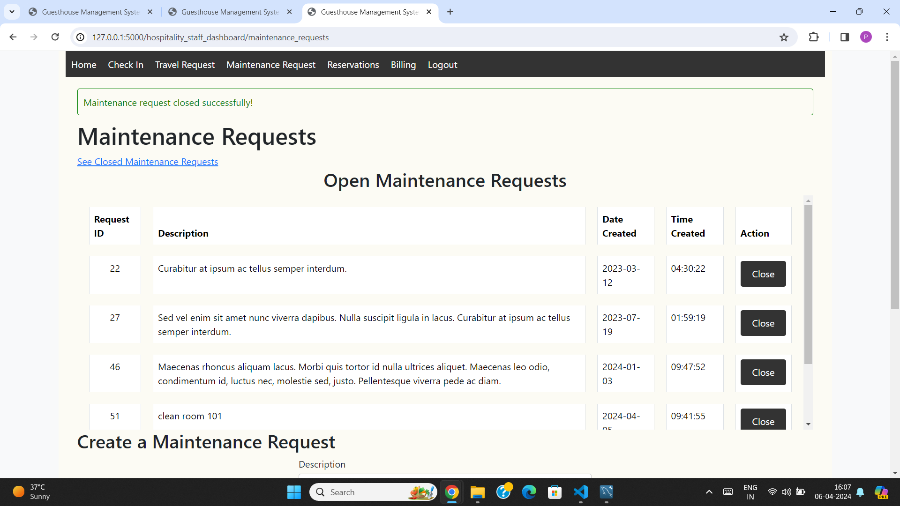

Pop-up Indicating Maintenance Request Deleted

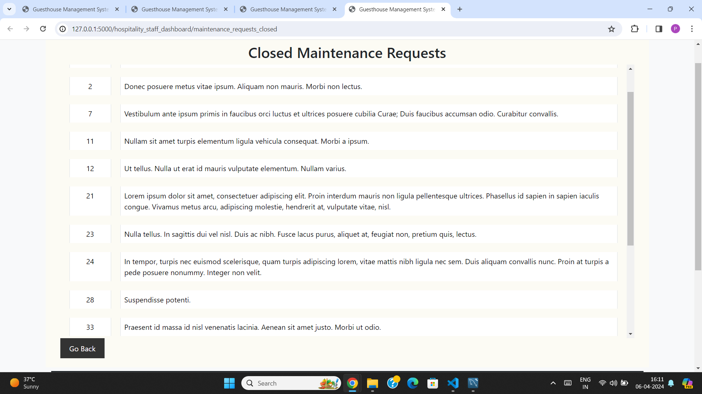

We can See Request ID=23 in Closed Maintenance Requests Section

In SQL Database we can see status for Request ID=23 is updated to ‘closed’

C. RENAME

1.  Before Renaming Password of Guest ID=4

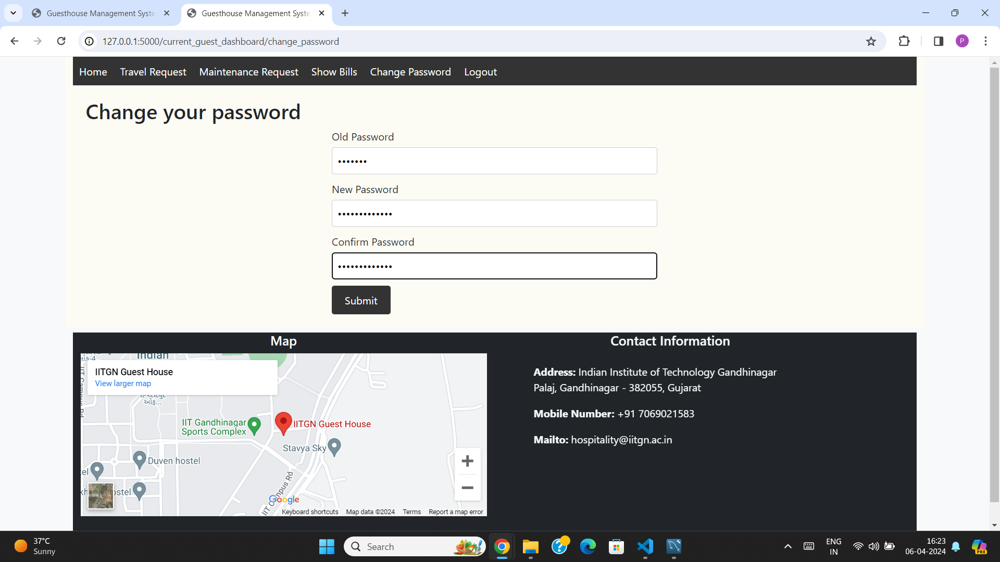

Window to Change Password

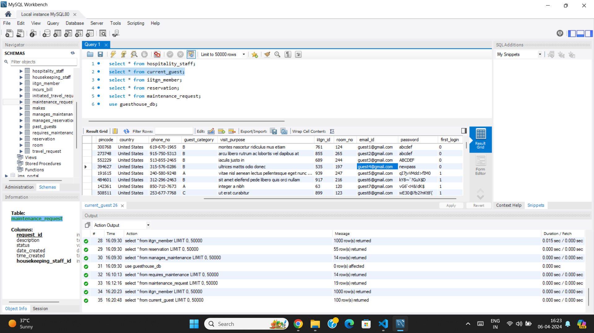

The initial Password of Guest 4 is ‘newpass’

2.  After Renaming Password for Guest ID=4

Pop Up indicating password change is sucessful

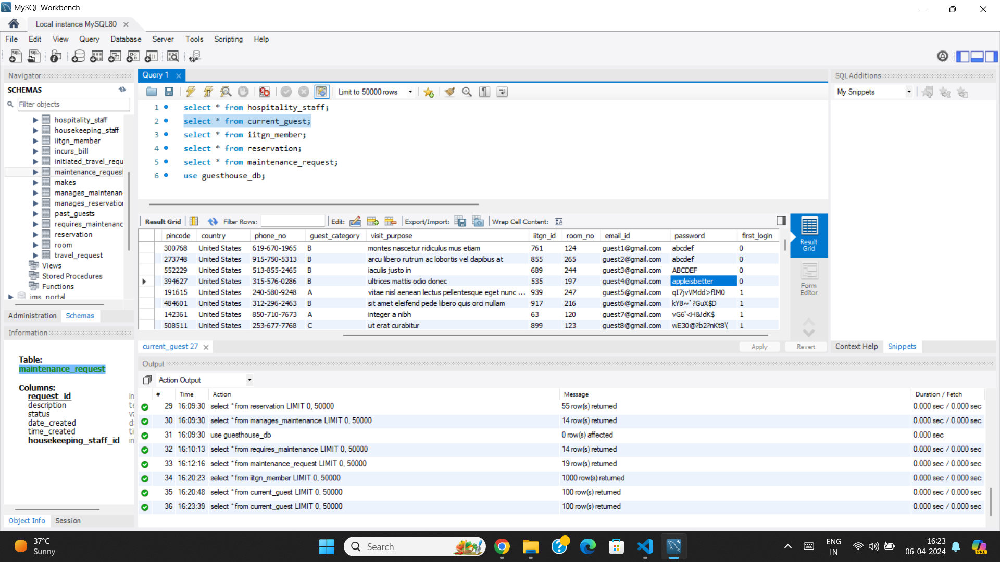

In Database, the password is renamed to ‘appleisbetter’

D. Where Clause

1.  Before applying where clause

Generating Incurred Bills where Guest ID=1

We Can See the Incurs\_bill table that establishes relationship between guest\_id and bill\_id

2.  After applying where clause

We Received a successfully generated popup, and all bills that are incurred by Guest ID=1

We have segregated the bills that are incurred by Guest ID=1 in MySQL Database using the ‘where’ statement.

E. UPDATE

1.  Before Update

For Guest who is login to their account for the first time, first\_login = 1

We enter their credentials

2.  After Update

In the MySQL database, the updated value for the first\_login column for guest = 0

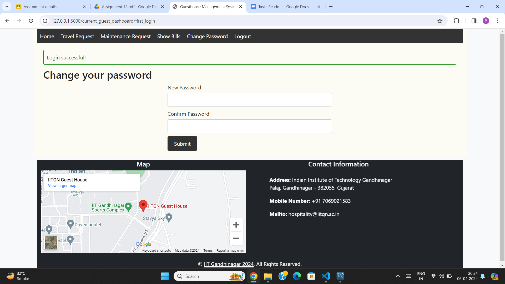

For first login the portal requires Guest to change password from default password

After password is changed login page opens

Login Views for Website

1.  IITGN Member View

Login Screen of IITGN Member with current reservations

Member could make a reservation

2.  Current Guests

Home Screen For Current Guests

Guests Can Make Travel Reservations

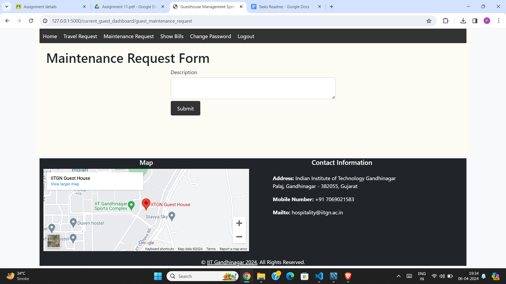

Guests can fill out maintenance request forms

Guests can find list of bills incurred

3.  Hospitality Staff

Home Page Hospitality Staff, staff can view occupied rooms and maintenance requests

Staff can view Check-In window where they can check-in Guests

Staff can fill travel requests when requested by guests

Staff can fill and view maintenance request forms filled by guests

Staff can manage and make new reservations

Staff can generate and view bills incurred by guests

4.  Driver Portal

Driver’s Portal Dashboard

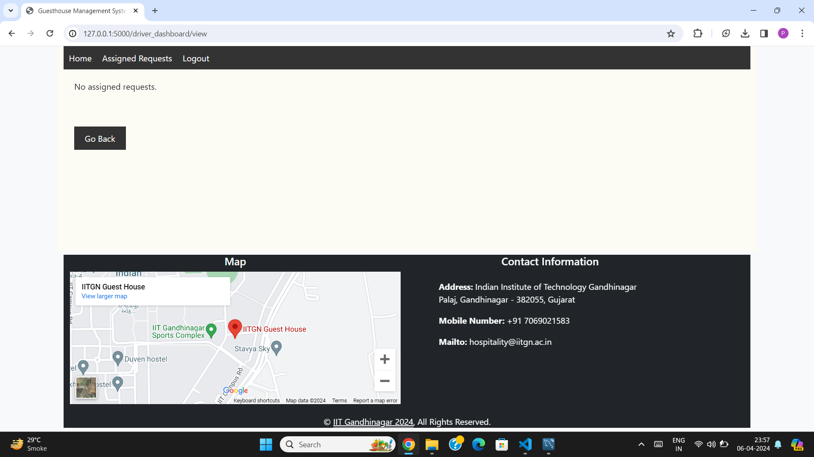

Assigned Request to a Driver

3\. Contributions:

1.  Gaurav Shah (Group Leader)

*   Created the design of the webapp for different views
*   Created dashboards for different views
*   Wrote code for the Backend part of the webapp

2.  Soham Rahatal

*   Helped in the Backend part of the webapp; creating some pages for admin (hospitality\_staff dashboard)
*   Helped in the documentation part of the report

3.  Pratik Agrawal

*   Completed the entire website Frontend, using the Bootstrap framework.
*   Designed Initial Sketches for the website and user interface.
*   Drafted Readme Report with explanations.

4.  Rohit Srivastava

*   Attended Initial Meeting on website ideation

5.  Banavath Diraj Naik

*   Attended Initial Meeting on website ideation

6.  Sohitha Sonalika.

*   Attended Initial Meeting on website ideation
*   Added Contacts in HTML file for initial webpage

7.  Shivamani

*   Attended Initial Meeting on website ideation
*   Created feedback page for admin (hospitality\_staff dashboard) view

Sub-groups:

G1:  Pratik Agarwal, Rohit Srivastav, Banavath Diraj Naik, Sohitha Sonalika

G2: Gaurav Shah, Soham Rahatal, Shivamani

* * *

The End

